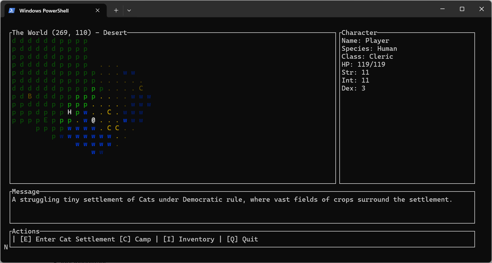
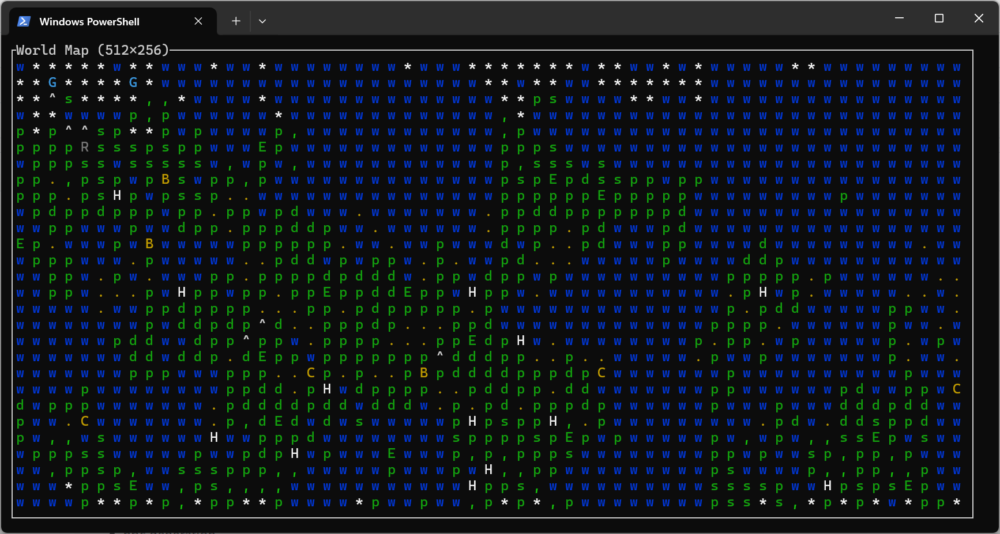

I'm learning rust by building a console rpg (although I'm using Ratatui for colors and widget frames)
The aim is to build a fully modular architecture with an rpg game core, generators, renderer and input systems separated. 

Current features:
- procedural world generation using Perlin and Ridged Multi Fractal noise
- move around using arrow keys
- map view with discovered tiles colored in as they are visited
- places of interests which you can enter by pressing 'e'. Leave by pressing 'q'
- world map view by pressing 'm'

Possible future features
- build out character creation system
- contextual actions
- npc generation
- dialogue system
- dungeon generator
- town generator
- cave generator
- mine generator

Screenshots:




## Building and Running

To compile the project you need a recent version of Rust. The game relies on the
`ratatui`, `crossterm`, `noise`, `rand` and `image` crates which are pulled in
automatically by Cargo.

Build the executable with:

```bash
cargo build
```

Launch the game with:

```bash
cargo run
```
